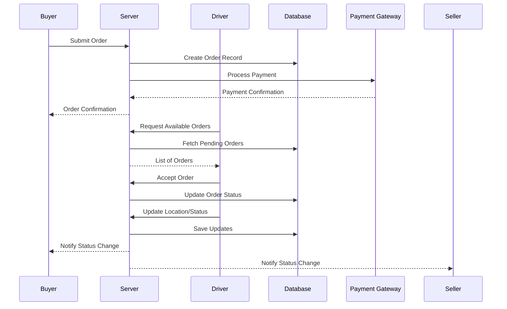

# StreetStashed – AGENTS Guide

## Scope & Stack

- Framework: Next.js (App Router where applicable), TypeScript, Tailwind, shadcn/ui
- Data: Supabase (auth, RLS, Postgres), Edge Functions
- Roles: buyer, seller, stylist, driver
- Branch: `master` is default

## What to work on

- `/app` and `/components` for UI
- `/lib/supabase` for client/server clients
- `/supabase` for SQL, policies, and edge functions
- `/pages/api` or `/app/api` for route handlers (project-appropriate)

## Style & Conventions

- Type-safe: prefer Zod for input validation
- Server-first: move secret logic to server/Edge Functions
- UI: shadcn/ui components, Tailwind classes; mobile-first
- Commits: conventional style; small diffs

## How to validate changes

- Install: `pnpm install`
- Lint: `pnpm lint`
- Typecheck: `pnpm tsc --noEmit`
- Test: `pnpm test` (if present)
- Build: `pnpm build`
- Run: `pnpm dev`

## Commands Codex should run

1. `pnpm install`
2. `pnpm lint && pnpm tsc --noEmit`
3. `pnpm build`
4. (if UI-only change) ensure no type/lint errors remain

## PR format

Title: `[MVP] <short change>`
Body must include:

- Summary
- Files touched
- Validation steps + command output
- Risks & roll-back plan

## Request Flow & File Map

### Request Flow Overview

- **Buyer Checkout**: Buyer selects items and submits an order through the UI.
- **Order Creation & Payment**: Server validates the order, processes payment, and records order details.
- **Driver Accepts Order**: Driver views available orders and accepts one to deliver.
- **Tracking Updates**: Driver updates order status and location; buyer and seller receive real-time updates.

### Sequence Diagram

### Main Files Involved

| Step                     | File(s) Involved              |
| ------------------------ | ----------------------------- |
| Buyer Checkout           | `/app/checkout/page.tsx`      |
| Order Creation & Payment | `/app/api/orders/route.ts`    |
| Driver Accepts Order     | `/app/driver/orders/page.tsx` |
| Tracking Updates         | `/app/api/tracking/route.ts`  |

### Database Tables

| Table Name       | Purpose                                      |
| ---------------- | -------------------------------------------- |
| `orders`         | Stores order details and statuses            |
| `order_items`    | Items associated with each order             |
| `drivers`        | Driver profiles and statuses                 |
| `order_tracking` | Tracks real-time location and status updates |
